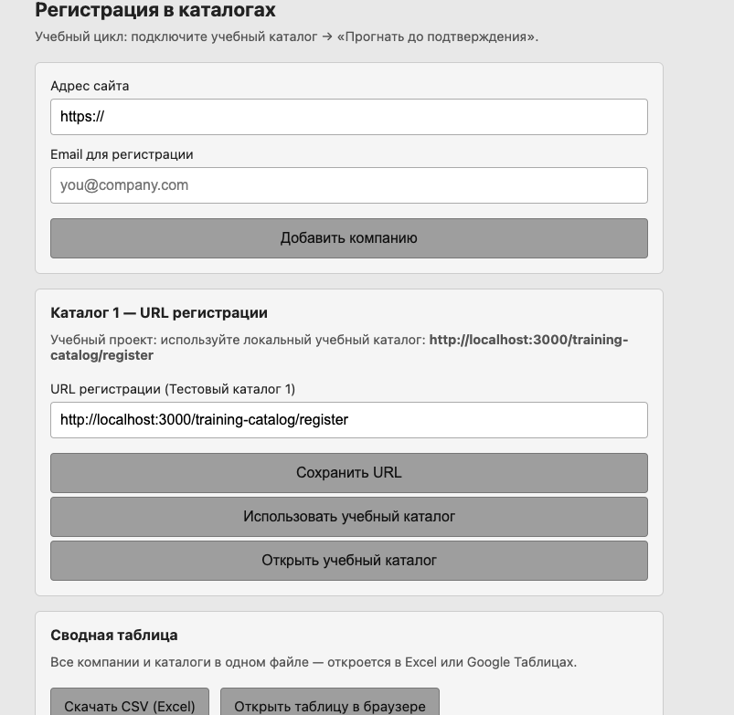
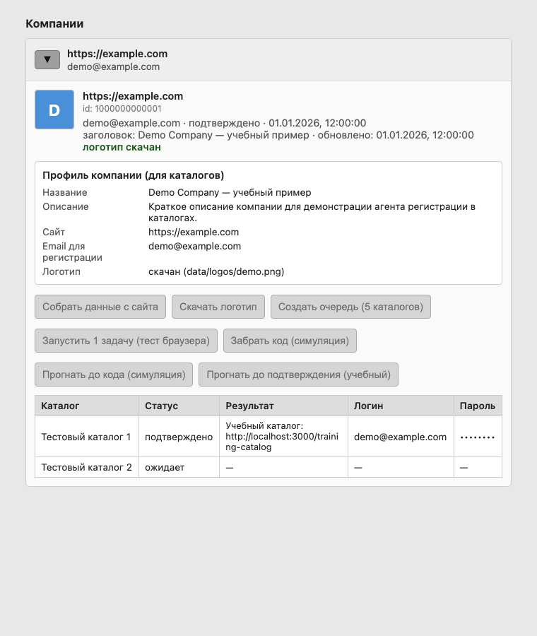
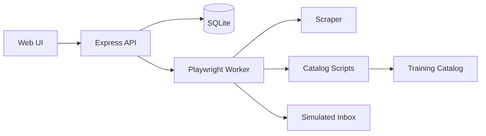

# Directory Agent

**Учебный агент регистрации компаний в каталогах** — веб-интерфейс, сбор данных с сайта, автоматизация браузера (Playwright), симуляция почты и экспорт в Excel.

> Проект создан для обучения: без реальных каталогов работает **локальный учебный каталог** на `localhost`.

<p align="center">
  <a href="https://github.com/OlgaPotapova684/directory-agent/actions/workflows/ci.yml"></a>
  
  
  
  
</p>

## Скриншоты

<p align="center">
  
  <br /><em>Главная — форма, учебный каталог, сводная таблица</em>
</p>

<p align="center">
  
  <br /><em>Карточка компании — парсинг сайта, очередь из 5 каталогов, автоматизация</em>
</p>

---

## Возможности

- **Несколько компаний** — сайт, email, отдельная карточка и очередь каталогов
- **Парсинг сайта** — заголовок, описание, логотип (og:image / favicon)
- **5 тестовых каталогов** — таблица статусов, логин, пароль, код подтверждения
- **Playwright-воркер** — регистрация, ввод email/пароля, подтверждение
- **Симуляция почты** — код подтверждения без IMAP и паролей
- **Учебный каталог** — полный цикл регистрации на вашем Mac
- **Экспорт CSV** — сводная таблица для Excel / Google Sheets
- **Сворачивание карточек** — удобно при нескольких компаниях

---

## Быстрый старт

### Требования

- [Node.js](https://nodejs.org/) 20+
- macOS / Linux / Windows (тестировалось на macOS, 8 ГБ RAM — ок)

### Установка

```bash
git clone https://github.com/OlgaPotapova684/directory-agent.git
cd directory-agent
npm install
npx playwright install chromium
```

### Запуск

```bash
npm start
```

Откройте в браузере: **http://localhost:3000**

Остановить сервер: `Ctrl+C`

---

## Типовой сценарий

1. **Добавить компанию** — URL (с `https://`) и email  
2. **Собрать данные с сайта** → **Скачать логотип**  
3. **Использовать учебный каталог** (блок «Каталог 1»)  
4. **Создать очередь (5 каталогов)**  
5. **Прогнать до подтверждения (учебный)** — статус `подтверждено`  
6. **Скачать CSV** — сводная таблица со всеми данными  

Учебный каталог вручную: http://localhost:3000/training-catalog

---

## Архитектура



---

## Структура проекта

```
directory-agent/
├── web/              # Сервер и интерфейс
├── worker/           # Очередь задач, Playwright
├── scraper/          # Сбор данных с сайта
├── email/            # Симуляция почты
├── catalogs/         # Сценарии каталогов (1–5)
├── db/               # SQLite, экспорт CSV
├── scripts/          # Тесты и утилиты
└── data/             # БД, логотипы (локально)
```

---

## Команды

| Команда | Описание |
|---------|----------|
| `npm start` | Веб-интерфейс на порту 3000 |
| `npm run test-browser` | Проверка Playwright |
| `npm run simulate-email` | Тестовое письмо с кодом |
| `npm run test-email` | Прочитать симуляцию почты |
| `npm run worker:once -- <site_id>` | Одна задача из терминала |

---

## Экспорт данных

- **Скачать CSV (Excel)** — на главной странице  
- **Открыть таблицу в браузере** — `/export.html`  

Файл содержит все компании и все каталоги в одной таблице.

---

## Учебный vs боевой режим

| Режим | URL каталога 1 | Почта |
|-------|----------------|-------|
| **Учебный** | `http://localhost:3000/training-catalog/register` | Симуляция (`data/simulated-inbox.json`) |
| **Боевой** | URL реального каталога | Подключить IMAP (заготовка в `.env.example`) |

---

## Переменные окружения

Скопируйте `.env.example` → `.env` (нужно только для будущего IMAP; симуляция работает без `.env`).

---

## Лицензия

[MIT](LICENSE) — свободно для учёбы и экспериментов.

---

## Автор

Учебный pet-project от [OlgaPotapova684](https://github.com/OlgaPotapova684).

Issues и Pull Request приветствуются.
